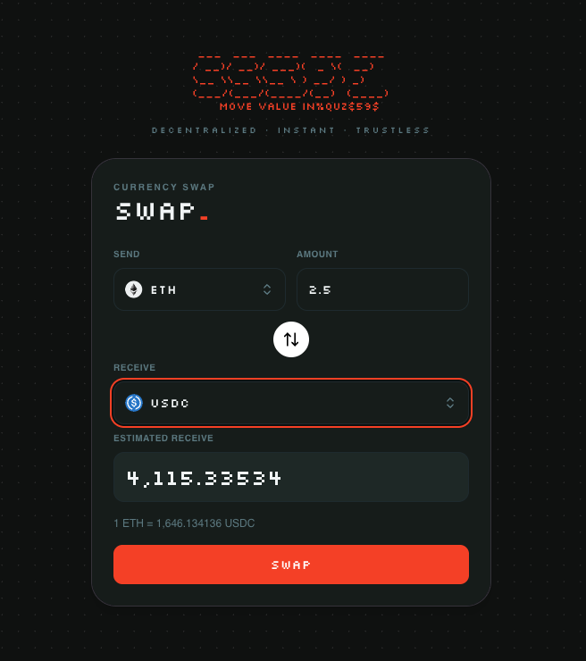
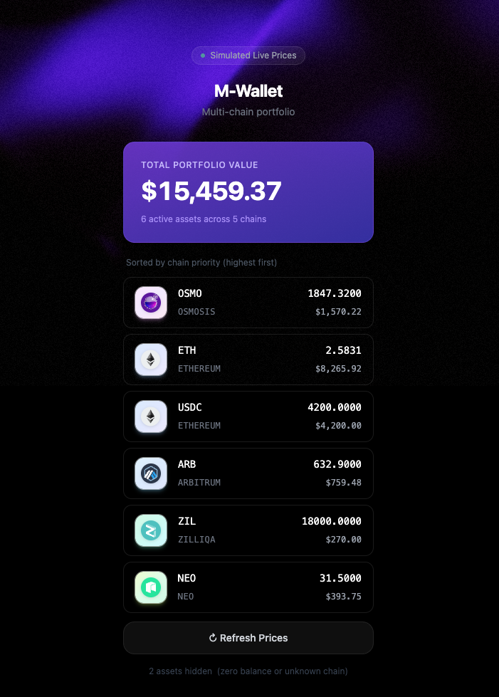
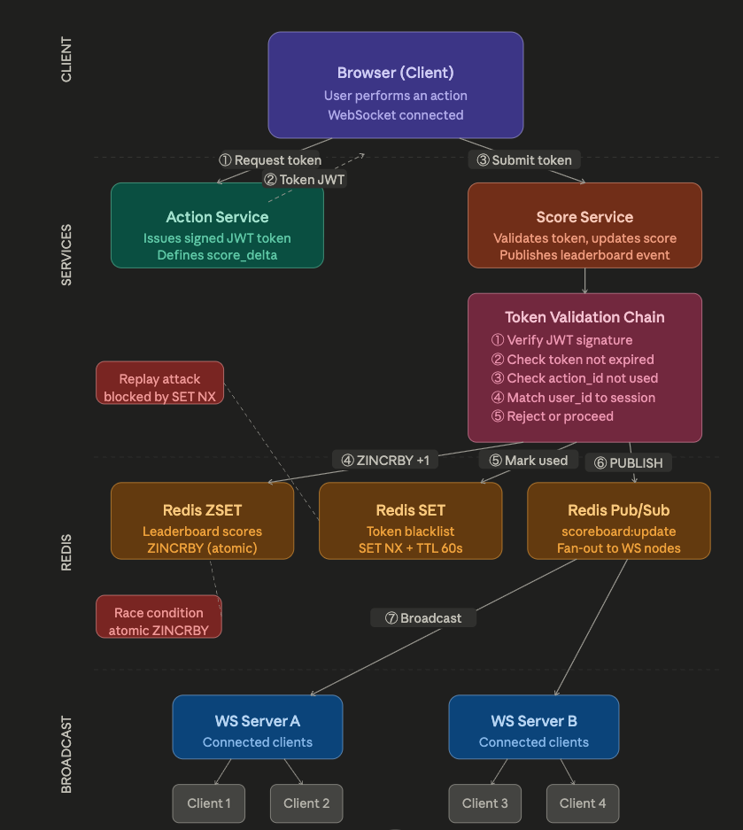

# 99Tech Code Challenge #1 #

Note that if you fork this repository, your responses may be publicly linked to this repo.  
Please submit your application along with the solutions attached or linked.

It is important that you minimally attempt the problems, even if you do not arrive at a working solution.

## Submission ##

You can either provide a link to an online repository, attach the solution in your application, or whichever method you prefer.  
We're cool as long as we can view your solution without any pain.

---

## Repository overview

This repository collects four independent coding exercises. Each lives under `src/` in its own folder. Dependencies and scripts are **per problem** (there is no single root `package.json`); open the README inside each problem folder for install and run commands.

**How to navigate**

1. Skim the folder diagram below to see where solutions live.
2. Open the matching section under [Problems](#problems) for the brief and **what to do** checklist.
3. Follow the nested `README.md` (or `Solution.md` for Problem 3) in that folder for detailed structure and verification steps.
4. For **Problem 6 (Architecture)**, the full specification and diagram live in `src/problem4/README.md` (the folder is named `problem4`; the brief in that file is Problem 6).

### Folder layout and roles

```
99_code_challenge/
├── readme.md                      ← You are here: challenge intro and map
└── src/
    ├── problem1/                  ← Three ways JS implementations + Node test runners
    │   ├── README.md              ← Approaches, project layout, how to run tests
    │   ├── sum_to_n_{a,b,c}.js
    │   └── tests/
    │
    ├── problem2/
    │   ├── fancy-ex/              ← Primary UI: Vite + React currency swap app
    │   │   ├── README.md          ← Install, dev, lint, build
    │   │   ├── package.json
    │   │   └── …
    │   └── style.css              ← Supplementary / template-related asset
    │
    ├── problem3/                  ← Messy React: analysis + refactors + demo app
    │   ├── Solution.md            ← Written review of issues and fixes
    │   ├── code-solution/         ← Refactored React/TS (direct answer artifacts)
    │   │   ├── fixed_solution.tsx
    │   │   └── note_code.tsx
    │   └── wallet-app/            ← Next.js demo illustrating the improved UX
    │       ├── package.json
    │       └── …
    │
    └── problem4/                  ← Problem 6: backend architecture spec (README + diagram)
        └── README.md              ← Scoreboard module specification, flow diagram, API notes
```

---

## Problems

### Problem 1 — Three ways to sum to `n`

**Brief**

Provide three **distinct** implementations of a function that sums `1 + 2 + … + n` in JavaScript.

**What to do**

- Read `src/problem1/README.md` for approach notes and file layout.
- Implement or verify `sum_to_n_a`, `sum_to_n_b`, and `sum_to_n_c` in `src/problem1/`.
- Run each test script from the repository root as documented in that README (e.g. `node src/problem1/tests/sum_to_n_a.test.js`, and likewise for `b` and `c`).

<details>
<summary>Original problem statement (expand)</summary>

```markdown
## Problem 1: Three ways to sum to n
### Task

Provide 3 unique implementations of the following function in JavaScript.

**Input**: `n` - any integer

*Assuming this input will always produce a result lesser than `Number.MAX_SAFE_INTEGER`*.

**Output**: `return` - summation to `n`, i.e. `sum_to_n(5) === 1 + 2 + 3 + 4 + 5 === 15`.

var sum_to_n_a = function(n) {
    // your code here
};

var sum_to_n_b = function(n) {
    // your code here
};

var sum_to_n_c = function(n) {
    // your code here
};
```

</details>

---

### Problem 2 — Fancy form (currency swap)

**Brief**

Build a currency swap form so users can exchange an amount from one asset/token to another. You may use any libraries you like; clarity and polish matter.

**What to do**

- Open `src/problem2/fancy-ex/README.md` for setup (`npm install`, `npm run dev`) and verification (`lint`, `typecheck`, `build`).
- Explore the Vite app under `src/problem2/fancy-ex/` (token icons, pricing hooks, form UX).
- Optionally review other files under `src/problem2/` if your template references them.



<details>
<summary>Original problem statement (expand)</summary>


```markdown
## Problem 2: Fancy Form
# Task

Create a currency swap form based on the template provided in the folder. A user would use this form to swap assets from one currency to another.

*You may use any third party plugin, library, and/or framework for this problem.*

1. You may add input validation/error messages to make the form interactive.
2. Your submission will be rated on its usage intuitiveness and visual attractiveness.
3. Show us your frontend development and design skills, feel free to totally disregard the provided files for this problem.
4. You may use this [repo](https://github.com/Switcheo/token-icons/tree/main/tokens) for token images, e.g. [SVG image](https://raw.githubusercontent.com/Switcheo/token-icons/main/tokens/SWTH.svg).
5. You may use this [URL](https://interview.switcheo.com/prices.json) for token price information and to compute exchange rates (not every token has a price, those that do not can be omitted).

<aside>
✨ Bonus: extra points if you use [Vite](https://vite.dev/) for this task!

</aside>

Please submit your solution using the files provided in the skeletal repo, including any additional files your solution may use.

<aside>
💡 Hint: feel free to simulate or mock interactions with a backend service, e.g. implement a loading indicator with a timeout delay for the submit button is good enough.

</aside>
```

</details>

---

### Problem 3 — Messy React

**Brief**

Review a flawed React (TypeScript, hooks) snippet: list inefficiencies and anti-patterns, explain fixes, and supply a refactored version. Strong analysis weighs more than code volume.

**What to do**

- Read the full write-up in `src/problem3/Solution.md`.
- Compare with `src/problem3/code-solution/` for the direct refactored code (`fixed_solution.tsx`, `note_code.tsx`).
- Run or extend `src/problem3/wallet-app/` if you want to see the scenario as a small Next.js demo app.



<details>
<summary>Original problem statement (expand)</summary>

```markdown
Problem 3: Messy React
# Task

List out the computational inefficiencies and anti-patterns found in the code block below.

1. This code block uses
    1. ReactJS with TypeScript.
    2. Functional components.
    3. React Hooks
2. You should also provide a refactored version of the code, but more points are awarded to accurately stating the issues and explaining correctly how to improve them.
```

</details>

---

### Problem 6 — Architecture (live scoreboard module)

**Brief**

Produce a written specification for a backend API module that powers a **top-10** scoreboard with **live updates**, accepts score changes only after **authorized** user actions, and **prevents** clients from inflating scores without going through the proper flow.

**What to do**

- Open **`src/problem4/README.md`**. That file is the canonical Problem 6 submission: task checklist, full module spec, execution-flow diagram (see `docs/images/prob_6.png`), API and WebSocket sketches, security model, and a section on improvements for the implementing team.
- **Folder note:** the repository path is `src/problem4/`, but the challenge heading inside that README is **Problem 6** — use that README as your single source of truth for this exercise.



<details>
<summary>Original problem statement (expand)</summary>

```markdown
## Problem 6: Architecture

### Task

Write the specification for a software module on the API service (backend application server).

1. Create a documentation for this module on a `README.md` file.
2. Create a diagram to illustrate the flow of execution.
3. Add additional comments for improvement you may have in the documentation.
4. Your specification will be given to a backend engineering team to implement.

### Software Requirements

1. We have a website with a score board, which shows the top 10 user's scores.
2. We want live update of the score board.
3. User can do an action (which we do not need to care what the action is), completing this action will increase the user's score.
4. Upon completion the action will dispatch an API call to the application server to update the score.
5. We want to prevent malicious users from increasing scores without authorisation.
```

</details>